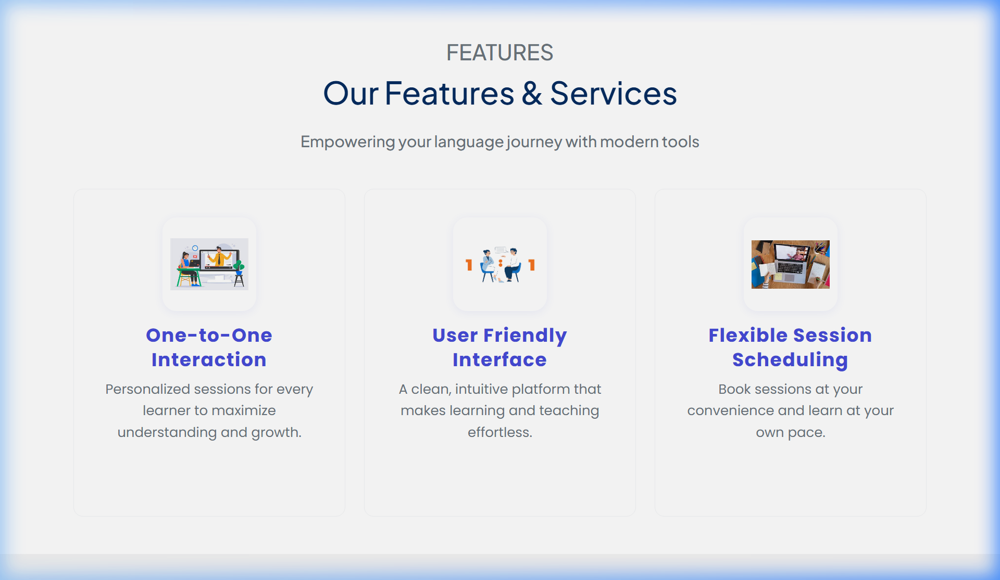
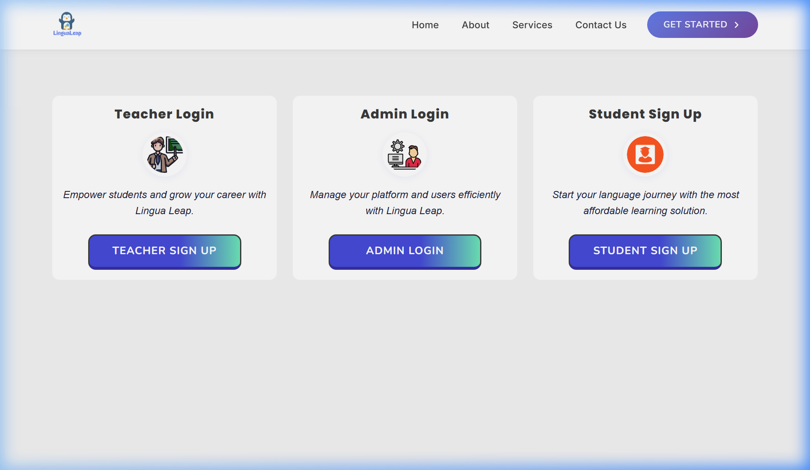
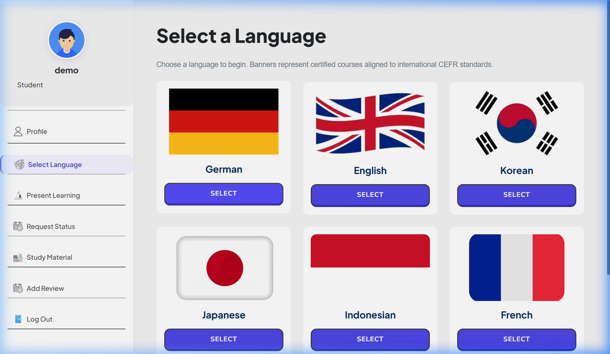
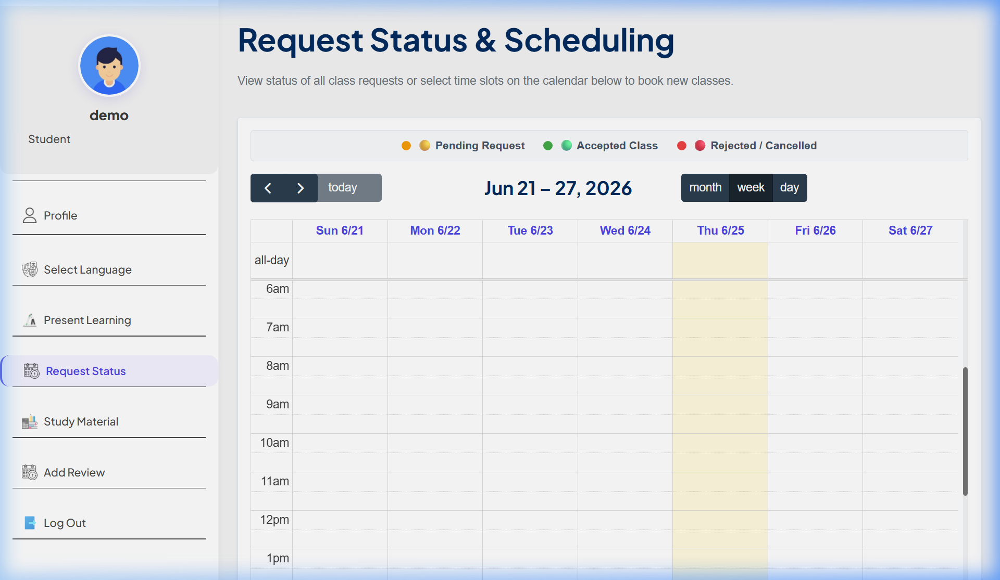
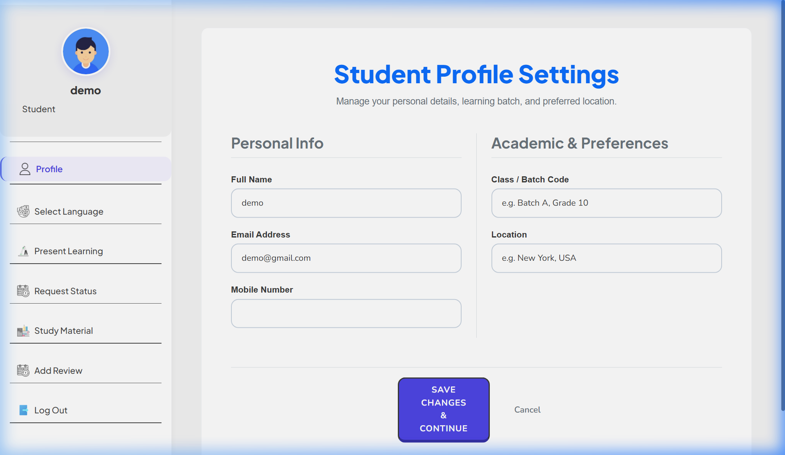
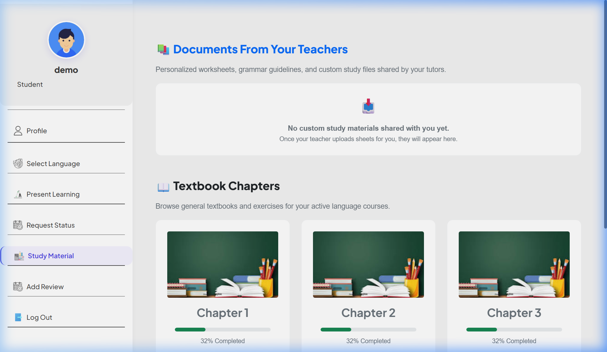
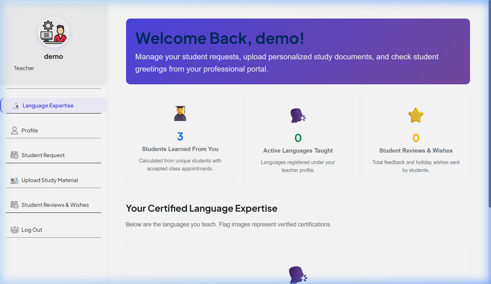
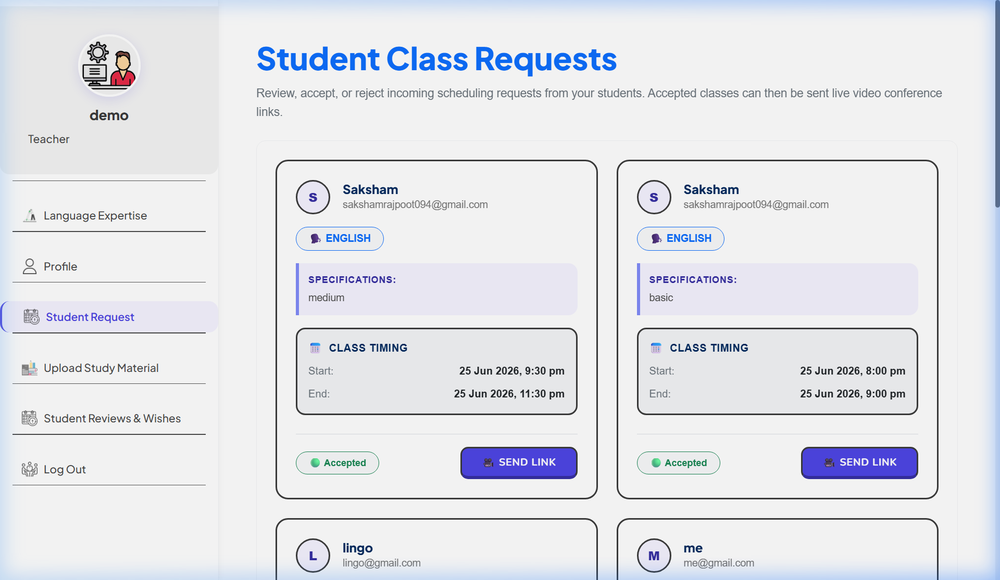
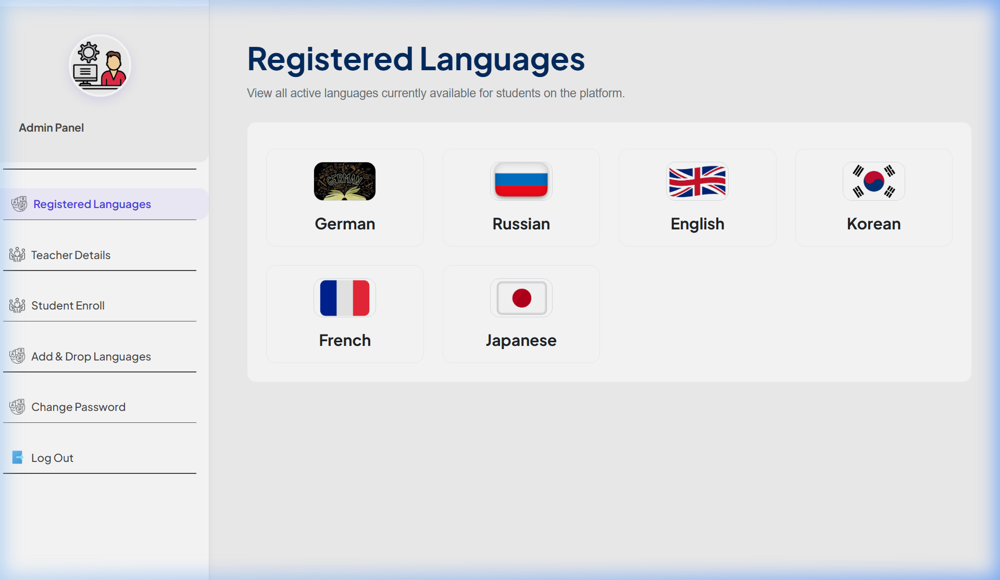

# 🌐 LinguaLeap - Personalized Language Learning Platform

LIVE LINK - https://lingualeap-learning.vercel.app/

> _“Learn, Connect and Grow” — Bridging borders through language._


## 📌 Project Overview

**LinguaLeap** is a personalized web-based language learning platform. It connects students and teachers globally through real-time one-on-one video sessions, offering flexible scheduling, study materials, slot booking, and multilingual support.

This project leverages modern web technologies (MERN stack) and project management practices (Agile, Jira) to deliver a robust, scalable, and user-friendly learning system.

---

## 🎯 Features

- 🔐 **Authentication System** – Secure login/signup for students, teachers, and admins.
- 🌍 **Language Selection** – Choose from a variety of global languages.
- 📅 **Slot Booking System** – View and book available teacher slots.
- 📚 **Study Material Access** – Teachers upload materials, students download them.
- 🌟 **Review System** – Two-way feedback and reviews from students and teachers.
- 🎥 **Live Video Integration** – Real-time 1:1 learning sessions.
- 🛠️ **Admin Control Panel** – Complete CRUD management for students, teachers, and language courses.

---

## 🛠️ Tech Stack

| Layer         | Technologies Used                                  |  
|--------------|-----------------------------------------------------|
| Frontend     | React.js, Bootstrap, React-Router, Axios            |
| Backend      | Node.js, Express.js                                 |
| Database     | MySQL (via XAMPP)                                   |
| Dev Tools    | Postman, GitHub, Jira                               |
| Other Tools  | React Calendar, CORS, Body-Parser, Nodemon          |
| Deployment   | Localhost / GitHub Pages / Render / Vercel (choose) |

---

## 📸 Snapshots

### 🏠 Homepage & Navigation


### 🛠️ Services Offered


### 🔑 Login Portal


### 👨‍🎓 Student Dashboard & Languages


### 📅 Student Calendar & Slot Booking


### 👤 Student Profile & Present Learning


### 📚 Study Materials


### 👩‍🏫 Teacher Dashboard


### 📩 Student Booking Requests


### 🛡️ Admin Panel (Management)


---

## ⚙️ Installation & Run Locally

1. **Clone the repository:**

```bash
git clone https://github.com/your-username/lingualeap.git
cd lingualeap
```
